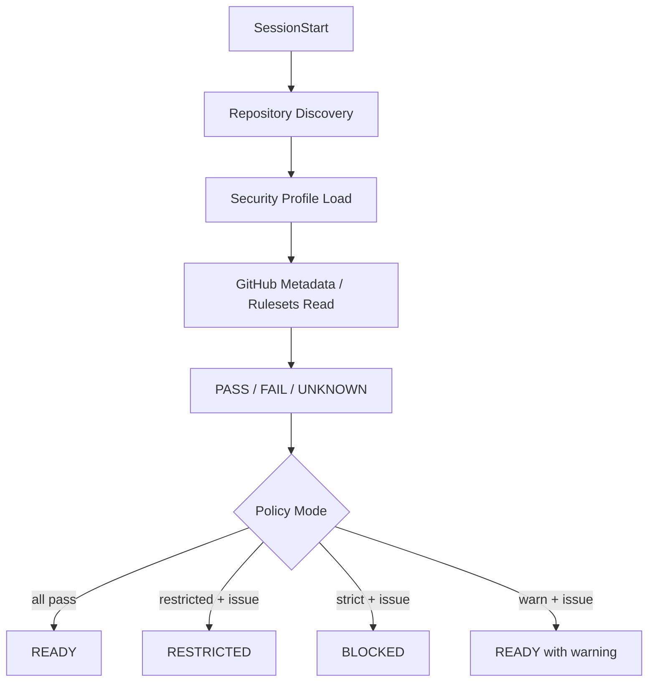

# DL-012 — SessionStart で Repository Security Posture を検証

- 日付: 2026-09-05
- Status: Accepted / Vendor Update 時に再評価
- 対象: Claude Code / Codex / Devin CLI / GitHub Repository Controls

## 判断

`SessionStart` で Repository Security Posture を検証し、正規化した結果を session state として cache します。Remote SCM mutation の直前には、cache が stale なら再検証します。

Checker は local repository identity と GitHub-side control（required pull request、non-fast-forward protection、required status checks 等）を確認します。各 check は `pass` / `fail` / `unknown`、session posture は `READY` / `RESTRICTED` / `BLOCKED` の3状態で表現します。

## 設定がない場合

`.agent-harness/security.json` が存在しないことは parser failure とは扱いません。Built-in `restricted` default を使用します。この状態では read-only discovery、local edit、test、local commit を継続できますが、必要な GitHub control を確認できるまで remote SCM mutation は許可しません。

明示的な設定ファイルが invalid な場合は別です。Control-plane failure とみなし `BLOCKED` にします。

## External State が確認できない場合

`UNKNOWN` は `FAIL` と区別します。GitHub API permission 不足、Ruleset API が plan / integration 上参照不可、一時的な metadata failure 等が該当します。

Mode semantics:

- `strict`: required check の `FAIL` または `UNKNOWN` が1つでもあれば `BLOCKED`
- `restricted`: required check の `FAIL` または `UNKNOWN` があれば `RESTRICTED`
- `warn`: warning を session context に注入するが `READY` を維持

## Enforcement

`SessionStart` は fail-fast / context injection の仕組みであり、最終 Security Boundary ではありません。`PreToolUse` でも cached posture を参照します。

- `BLOCKED`: mutation を deny
- `RESTRICTED`: `git push`、`gh pr create` 等の remote SCM mutation を deny。local development は継続可
- `READY`: 通常の central policy に従う

Posture cache には TTL を持たせ、trust-boundary crossing operation の前に stale なら再検証します。

## 責務分離

Checker の責務は configuration drift の検出です。GitHub enforcement の代替ではありません。Rulesets / Branch Protection を authoritative enforcement、IAM を credential compromise containment、Sandbox を local capability boundary、Hooks を semantic operation policy とします。

## 再評価条件

Vendor の SessionStart control semantics が強化された場合、GitHub protection metadata がより一貫して read 可能になった場合、または organization-level policy service が authoritative posture を供給できるようになった場合に再評価します。
