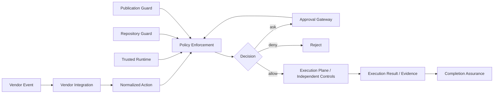
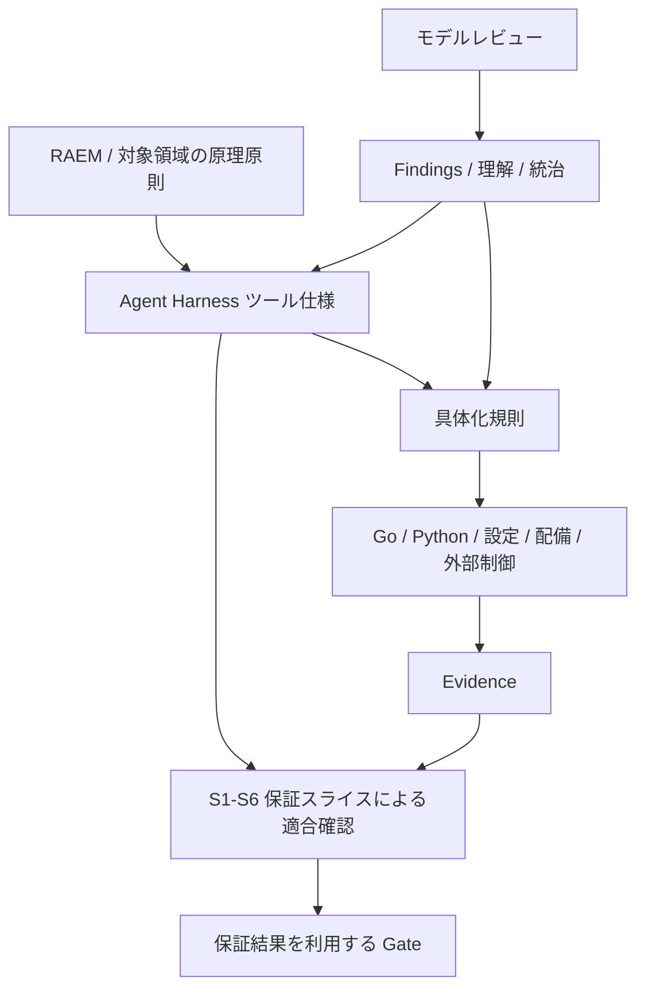

[README](../../README.ja.md) | [アーキテクチャ](../ja/01-architecture.md) | [RAEM](../../raem/refinement-assurance-and-evolution-model.ja.md)

# Agent Harness ツール仕様書

## 1. 文書の位置づけとステータス

**ステータス: Draft / 仕様書骨格。** Agent Harness 全体の、実装言語・ベンダーから独立した責務と振る舞いを定義する。既存文書に基づく契約の基線を示すが、CLI、schema、数値制限などは未確定であり、完成済みの実装仕様や適合宣言ではない。

本文の「契約」は今後の具体化・適合確認が満たすべき要求、「詳細化項目」は実装前に仕様として決定する事項を表す。後者は第20章の Open Questions に対応する。未決事項を実装の偶然の挙動で確定したことにしてはならない。部分実装は対象契約・未対応契約・成立前提を明示する。

**S1〜S6 は保証スライスであり、ツールのコンポーネント、実行フェーズ、CLI の分類ではない。Go / Python は具体実装であり、仕様そのものではない。** S1 の具体化を先行しても、全体仕様を「Go版S1ツール仕様」に限定しない。

### 既存文書との分担

| 文書 | 所有する内容 | 本仕様の役割 |
|---|---|---|
| [Architecture](../ja/01-architecture.md) | Control / Execution Plane、状態機械、配置の全体像 | ツールの責務と境界に接続する |
| [Design Principles](../ja/02-design-principles.md) | 設計原則と理由 | 振る舞いを制約する契約として参照する |
| [Security Model](../ja/03-security-model.md) | 脅威、多層防御、外部強制境界 | ツール側の前提・失敗時動作・非保証を明示する |
| [Adoption Guide](../ja/04-adoption-guide.md) | 段階導入、権限拡大の exit criteria、運用 | 導入段階と仕様適合範囲を混同しない |
| [Product Mapping](../ja/05-product-mapping.md) | 製品機能への対応と参照先 | ベンダー共通契約と adapter の責務を定義する |
| [RAEM](../../raem/refinement-assurance-and-evolution-model.ja.md) | 具体化、適合保証、モデルレビュー、進化と統治 | Agent Harness という対象の仕様へ適用する |
| 本仕様 | ツールの意味・契約・未決事項 | 具体実装と保証スライスの共通参照点になる |

既存文書の説明・製品機能表・配備手順を複製しない。要求の矛盾が見つかった場合は、実装を正として上書きせず、根拠と影響を記録して仕様と関連文書を整合させる。必要になった詳細仕様は本書からリンクし、同じ契約を複数文書で独立管理しない。

## 2. 全体像と目的

Agent Harness は、自律型ソフトウェア開発エージェントの提案する操作を、明示した権限・信頼境界・予算・完了条件の中で実行するための仕組みである。安全な通常操作を自律的に進め、境界を越える操作を拒否または適切な承認経路へ送る。名称は単一実行ファイルを意味せず、制御、実行環境、外部認可との接続を含む。

利用者・運用者はタスク、許可範囲、完了条件を定める。Agent は調査・計画・実装・未知の問題の探索を担う。Harness は決定可能な規則の評価と結果の記録を担い、OS / IAM / SCM 等が独立した強制境界を提供する。

期待する成果は、操作判断の再現性、最小権限での自律実行、根拠に基づく完了判定、失敗から復旧・改善できる運用である。すべての要求を機械判定できるという主張ではない。

## 3. 用語と責務境界

| 主体・概念 | 責務 | 境界 |
|---|---|---|
| Agent / subagent | 推論、操作提案、成果物作成、モデルレビュー | 自身の出力を承認・保証の最終権威にしない |
| Harness Control Plane | policy、承認、予算、タスク状態、完了状態の管理 | 正本をモデルコンテキスト外に保持する |
| Execution Plane | 許可された操作を制限された環境で実行する | policy の allow により能力境界を解除しない |
| 運用者 / Approval Gateway | trusted configuration と権限委譲の管理 | repository-controlled な指示と独立する |
| 外部強制機構 | sandbox、workload isolation、network、IAM、SCM の強制 | Hooks や Agent の協力に依存しない |
| Normalized Action | 操作・対象・文脈を表す共通モデル | 入力上の自己申告と検証済み事実を区別する |
| Evidence | 判断・適合主張を支える根拠 | 出所、対象、取得時点、評価条件を持つ |

## 4. 論理アーキテクチャ

| 機能・責務 | 入力と出力の概念 | 主な接続先 |
|---|---|---|
| Trusted Runtime | trusted な起動・設定を確立し、検証結果を返す | 全コンポーネント |
| Policy Enforcement | Normalized Action と検証済み文脈から allow / ask / deny を返す | Repository / Publication、Approval Gateway |
| Repository Guard | repository identity / posture から mutation authority を検証する | Policy Enforcement、実行直前の検証 |
| Publication Guard | 公開対象・差分・外部権限を検証する | Git / PR、control-plane change detection |
| Completion Assurance | Evidence と完了条件から判定・不足を返す | Orchestrator、CI、モデルレビュー |
| Vendor Integration | vendor event / response と共通契約を相互変換する | Agent Runtime、Policy Enforcement |

これらは論理上の責務であり、プロセス数、パッケージ構成、言語、配置を指定しない。承認、監査、永続状態、予算は横断的な Control Plane の責務とする。

図は論理フローであり、Hooks がすべての経路を捕捉できるという主張ではない。呼出し契約は第9章、捕捉できない経路の扱いは第15・16章で定める。

## 5. 原理原則

[設計原則](../ja/02-design-principles.md)を基線とし、次を契約に反映する。

- LLM、Prompt、AGENTS.md、Skills、subagent は行動制御であり、セキュリティ境界にしない。
- semantic policy と capability control を分離し、OS、workload、network、外部認可による多層防御を保つ。
- 最小権限と限定的な承認経路を採用し、deny を承認で上書きしない。
- 既知で決定的に表現可能な判断を仕組みに固定する。同じ入力・規則・評価条件には同じ判断を返す。
- 完了は Evidence に基づく predicate とし、自律ループには上限を設ける。
- Agent が見つけた未知の問題はモデルレビューと統治を通して仕様へ反映する。Agent 自身の判断で規範や強制境界を緩めない。

## 6. 信頼モデル / Trusted Runtime

**契約 TR-01:** trusted な実行物と設定の選択・完全性は、対象 repository や Agent が変更できる入力に委ねない。cwd、import / executable search path、環境変数、symlink、repository 内設定から任意の実行物・adapter・policy へ差し替えられる構成を trusted とみなさない。

trusted configuration、承認情報、永続タスク状態と、repository content、hook payload、tool output、モデル生成文を区別する。後者は検証対象であり、入力に「trusted」と書かれているだけでは信頼しない。trusted であることは単なる絶対パスの使用や単一バイナリ化からは導けない。

**詳細化項目:** trusted root の選択主体、所有権・権限、配布・更新・失効、path resolution、symlink、環境変数の許容範囲、起動時と利用時の再検証を定義する（Q-01）。TCB と配備前提は第16章を参照。

## 7. 実行モデル

[Architecture の状態機械](../ja/01-architecture.md)を基線に、調査 → 計画 → 専用 worktree で変更 → 検証 → commit → 公開 → CI 確認 → 完了判定を扱う。read-only タスクは変更・公開を要求せず、タスクで宣言した完了条件へ進む。PR 作成は merge の認可を意味しない。

**契約 EX-01:** task identity、状態、承認、予算、判断の根拠をモデルコンテキスト外に保持する。再起動・compaction・subagent 実行後も正本に照合し、状態や権限をモデルの記憶から再構成しない。

**契約 EX-02:** ask は承認待ち、deny は対象操作の拒否とする。失敗や予算超過を完了扱いにせず、再試行は上限内で行う。handoff は信頼境界の遷移として再認可する。

**詳細化項目:** 状態遷移条件、並行操作、再開、取消、冪等性、予算計数、circuit breaker を定義する（Q-06）。

## 8. ツール振る舞い

**契約 BH-01:** 実行前に入力検証・正規化、信頼と対象の検証、適用 policy の評価、必要な承認の検証を行う。adapter は決定を vendor response へ変換する。実行後は結果と Evidence を記録し、必要な完了条件を評価する。

| 判断 | 呼出し側に要求する振る舞い |
|---|---|
| allow | 評価した対象・範囲内でのみ実行可能。sandbox / 外部認可への許可を代替しない |
| ask | 有効な承認が得られるまで実行しない。承認後も現在の policy と対象を再評価する |
| deny | 対象操作を実行しない。通常の承認で反転しない |

**契約 BH-02:** 判断と実行成功を区別する。allow の返却は実行完了の証拠ではなく、deny の返却だけで外部の強制が成功したともみなさない。出力不能・timeout・未対応イベントの扱いは第15章に従う。

## 9. CLI / プロトコル

本章は言語非依存の外部契約の定義場所である。現行 Python の起動方法や Go の package layout を標準 CLI として採用済みとはみなさない。

| 契約面 | 詳細化すべき事項 |
|---|---|
| 起動 | executable 名、引数・subcommand、実行モード、cwd、環境変数、設定解決 |
| 入力 | Normalized Action と vendor payload の境界、schema/version、必須・任意 field、型、unknown field、サイズ制限 |
| 出力 | decision、reason、rule / policy identity、相関 ID、error の表現、schema/version |
| I/O | stdin / stdout / stderr、encoding、framing、単発・継続処理、ログとの分離 |
| 終了 | exit code と policy decision の関係、signal、timeout、cancel、出力途中の終了 |

**契約 IO-01:** 機械可読応答と診断ログを混在させない。JSON over stdin/stdout を採用するモードでは stdout をプロトコル専用とする。成功終了コードだけを allow の意味にせず、応答と終了状態の対応を明示する。

**詳細化項目:** wire schema、CLI 形状、具体的 exit code、正常・異常例、互換性規則を確定する（Q-02）。本章のフィールド名は概念であり、確定した wire schema ではない。

## 10. Policy

**契約 PO-01:** deny は競合する ask / allow より優先する。ask は外部承認を必要とする判断、allow は制約下の実行許可である。分類不能な操作や必須の信頼検証失敗を暗黙の allow にしない。

**契約 PO-02:** 評価結果を再現するため、policy identity / version、正規化入力、参照した外部状態と評価条件を Evidence に結びつける。「同じコマンド文字列」だけを同一入力とみなさない。

**詳細化項目:** policy schema、rule order と競合時の理由選択、ask と allow の優先関係、default decision、matching / regex semantics、unknown field、schema validation、更新と承認の失効を定義する（Q-03）。欠落・読取不能・不正 policy は第15章に従い、repository 内の代替 policy に黙ってフォールバックしない。

## 11. Repository Guard

**契約 RE-01:** repository identity、worktree / branch、remote、保護状態（posture）と操作権限を検証する。payload や cwd の自己申告だけで mutation authority を与えない。

**契約 RE-02:** 通常の変更はタスク専用 worktree / feature branch で行い、control checkout と protected / default branch の直接変更を通常の自律経路に含めない。commit / push 前に対象を再検証する。

**詳細化項目:** identity の正本、posture の取得元・鮮度、worktree と branch の対応、symlink や別 remote、検証と実行の間の状態変化（TOCTOU）を扱う（Q-04）。外部 SCM の保護をローカル判定だけで保証したことにしない。

## 12. Publication Guard

**契約 PU-01:** Git push と PR 作成は、検証済み repository / branch / commit と認可範囲に結びつける。merge、tag / release、production への公開は通常の feature branch 公開と区別し、明示した認可経路を必要とする。

**契約 PU-02:** CI workflow、policy、hook、権限・配備設定などの control-plane 変更を識別し、通常のアプリケーション変更と同じ根拠だけで公開許可しない。検査対象を working tree だけに限定せず、実際に公開する差分・commit と結びつける。

**詳細化項目:** control-plane 分類と管理主体、push refspec / destination、PR head / base、差分の確定方法、認可・Evidence の有効範囲を定義する（Q-05）。SCM server-side authorization を最終権威とし、ローカル許可による bypass を認めない。

## 13. Completion Assurance

**契約 CO-01:** 完了条件はタスクに対して明示し、tests、Git / PR / CI 状態などの Evidence で決定的に評価する。モデルの完了宣言や自己評価を合格の根拠にしない。必要な Evidence が欠ける・古い・対象が異なる場合は完了としない。

**契約 CO-02:** 判定結果を利用する Completion Gate と、主張・根拠・推論による適合保証を区別する。Agent の completion review loop は不足の修正や未知の問題の発見を担い、決定的な判定を上書きしない。再試行とレビューには予算・停止条件を設ける。

**詳細化項目:** predicate の宣言者、結果状態と不足理由、Evidence の出所・鮮度・commit との結びつき、保存期間、予算枯渇時の処理を定義する（Q-06、Q-07）。具体的なチェック一覧の例は [Architecture](../ja/01-architecture.md) を参照する。

## 14. Vendor Integration

**契約 VE-01:** vendor event を Normalized Action へ、共通判断を vendor response へ変換する。policy engine に製品固有の schema や偶然の終了コードを埋め込まない。adapter の選択も trusted configuration の境界に含める。

**契約 VE-02:** adapter ごとに対象製品・version、対応イベント、承認方法、timeout / crash / malformed output の実動作、捕捉できない操作経路を明示する。共通契約を実現できない機能をサポート済みと表示しない。未対応を allow へ読み替えない。

**詳細化項目:** capability 宣言、version 対応表、変換不能時の応答と配備の可否、adapter conformance vectors を定義する（Q-08）。具体的な製品情報は [Product Mapping](../ja/05-product-mapping.md) と各製品の公式文書・検証結果で管理する。本仕様は各製品の現時点の機能を新たに保証しない。

## 15. Failure semantics

**契約 FA-01:** セキュリティ上重要な検証が成立しない場合、Harness は許可・完了を返さない。拒否を表現できない transport / runtime failure は失敗として伝播させる。呼出し元がそれを無視して継続する場合は fail-open として記録し、その経路の hard invariant を Hook だけに依存させない。

| 条件 | 意味上の結果・復旧境界 |
|---|---|
| malformed input、必須 field 欠落、型不正 | 処理失敗。許可を返さず入力を修正する |
| policy 欠落・不正・読取不能 | 処理失敗。運用者が trusted policy を復旧する |
| 実行物・設定の信頼境界違反 | 拒否または起動失敗。repository 側の代替物で継続しない |
| repository / publication 検証不能、対象変化 | 許可を返さず、正本から再取得・再評価する |
| 承認未取得・失効・scope 不一致 | 実行しない。必要な承認を取得して再評価する |
| 外部 API / SCM / network エラー | 成功と断定しない。外部状態を照合してから再試行する |
| timeout、signal、crash / panic、予期しない内部例外、I/O エラー | 許可や成功へ変換しない。呼出し元の停止挙動を別途検証する |
| Evidence 不足、必須 CI の失敗・保留 | 完了不成立。不足・失敗を報告する |
| retry / time / tool / cost budget 超過 | 自律ループを停止し、状態と理由を保持する |

エラーを受け取っても、すでに生じた副作用が取り消されたとはみなさない。特に公開後に応答を失った場合は、外部状態が不明なまま同じ操作を反復しない。

**詳細化項目:** error taxonomy、再試行可否、backoff、部分成功、audit 書込失敗時の扱い、exit / wire 表現を定義する（Q-02、Q-06、Q-09）。

## 16. Security assumptions / 配備前提

[Security Model](../ja/03-security-model.md) の脅威・TCB・多層防御を適用する。具体実装の適合性はコードだけではなく、設定・配置・外部保護・実行時状態・運用前提を含めて評価する。

| 前提 | 確立・検証する主体 | 前提が欠ける場合の限界 |
|---|---|---|
| 実行物・policy・adapter の完全性と更新権限 | 配布・運用管理者 | trusted な判断主体を主張できない |
| OS / filesystem / process 境界、Agent からの設定保護 | 実行環境管理者 | local policy の改変・迂回を封じ込められない |
| sandbox と workload isolation | 実行環境管理者 | host / 他 workload の保護を主張できない |
| network 制御、credential scope / expiry | network / IAM 管理者 | 到達可能先・外部 authority を限定できない |
| SCM ruleset / branch protection と bypass 不可の credential | SCM 管理者 | protected branch の最終防御を主張できない |
| 実際の Hook failure behavior と経路の網羅性 | adapter / 配備管理者 | Hook による fail-closed enforcement を主張できない |

Agent の repository 書込権限に trusted policy 更新権限を含めない。MCP / 外部ツールも独立した認証・認可を必要とする。前提が成立しない配備で、成立時と同じ保証を表示しない。段階導入は [Adoption Guide](../ja/04-adoption-guide.md) の exit criteria に従う。

## 17. Non-goals / 非保証範囲

- LLM の完全な正しさ、prompt injection の完全排除、Hook 単独による全操作の封じ込め。
- sandbox、container、IAM、SCM server-side policy の置換。
- Go / Python 固有の内部構造、全ベンダー機能の統一、単一実行ファイルへの強制。
- すべての実装言語・配備環境での同一保証や、未検証の adapter の動作保証。
- 汎用的な本番管理権限、自動 merge の暗黙認可、無制限の修復ループ。
- テスト合格による未知の欠陥の不存在証明、RAEM 自体の再定義。

## 18. Compatibility / 仕様の進化

**契約 CP-01:** 互換性を、意味・保証契約、CLI / wire schema、policy schema、adapter / deployment の各軸で記録する。Go / Python の比較では対応する契約と test vectors を明示し、片方の出力との一致だけを仕様適合としない。

現行実装の挙動は具体化・評価の資料である。仕様との差異は、仕様側の未決、実装側の不適合、意図的な互換性変更を区別する。言語固有の import path、例外、regex、serialization 等を無条件に共通契約へ引き継がない。

**詳細化項目:** versioning、互換範囲、移行期間、廃止、version 不一致時の扱い、比較表の保管場所を定義する（Q-10）。骨格段階の本書から、既存 CLI との互換性を宣言しない。

## 19. Test contract / Assurance との関係

RAEM では具体化と適合保証を分離する。本仕様は Agent Harness に必要な契約をまとめ、具体化規則が Go / Python・設定・配備・外部制御へ接続する。S1〜S6 はその具体化が何を保証するかを、主張・Evidence・推論で横断的に確認する別軸である。

### 保証スライスとの参照対応（骨格）

以下はレビュー観点の索引であり、スライスの保証契約そのものや適合済みの宣言ではない。1 機能と 1 スライスの一対一対応を強制しない。

| 保証スライス | 主に参照するツール契約 |
|---|---|
| S1 trusted execution / policy | TR-01、PO-01/02、IO-01、FA-01、配備前提 |
| S2 repository authority | RE-01/02、EX-01、TR-01 |
| S3 SCM publication | PU-01、RE-01/02、PO-01/02 |
| S4 control-plane publication | PU-02、TR-01、PO-01 |
| S5 completion assurance | CO-01/02、EX-01/02、FA-01 |
| S6 vendor / deployment | VE-01/02、FA-01、配備前提、CP-01 |

S1〜S6 の作業は現時点では未マージの [PR #6](https://github.com/tomo-chan/agent-harness/pull/6)、[PR #7](https://github.com/tomo-chan/agent-harness/pull/7)、[PR #8](https://github.com/tomo-chan/agent-harness/pull/8)、[PR #9](https://github.com/tomo-chan/agent-harness/pull/9)、[PR #10](https://github.com/tomo-chan/agent-harness/pull/10)、[PR #11](https://github.com/tomo-chan/agent-harness/pull/11) にある。本書はそれらの採用・マージを前提にせず、確定時に参照を更新する。

### 適合確認で用意するもの

- 契約 ID → 具体化規則 → 実装・設定 → Evidence → 保証規則 → 結果の対応表。
- policy / normalization / schema の unit tests と、言語間で共有または対応する正常・異常 test vectors。
- trusted startup、cwd / 環境 / path 差し替え、repository 誤認、公開対象変化、承認不一致の negative / integration tests。
- timeout / crash / malformed response、未対応 version、迂回経路に対する adapter / deployment tests。
- Evidence 欠落・古さ・対象違い、CI 保留、予算枯渇、再開を含む completion tests。
- 外部 IAM / SCM / sandbox の根拠。unit tests で外部保護の成立を代用しない。

**詳細化項目:** vector 形式・配置、CI 必須条件、部分適合の表示、保証規則の version を定義する（Q-11）。全テスト PASS とモデルの十分性は別であり、モデルレビューを継続する。

## 20. Open Questions

骨格作成で CLI や配備方式を先取りしない。各問いは担当する契約と解決条件を持ち、関連部分の実装着手前に解決するか、実験としての仮定・非適合範囲を明記する。全機能の詳細確定まで部分的な具体化を止める必要はない。

| ID | 未決事項 | 解決に必要な成果物・判断時点 |
|---|---|---|
| Q-01 | trusted root / binary / policy / adapter の所有・解決・更新・失効、path / symlink / env | 信頼解決契約と攻撃ケース。Trusted Runtime の具体化前 |
| Q-02 | CLI、wire schema、unknown field、size、I/O、exit / signal / timeout | 入出力契約と正常・異常例。CLI / adapter の具体化前 |
| Q-03 | policy schema、競合と順序、default、matching、承認 scope / expiry | policy と承認の評価規則・vectors。Policy の具体化前 |
| Q-04 | repository identity / posture の正本・鮮度、TOCTOU | 取得・再検証契約と誤認ケース。Repository Guard の具体化前 |
| Q-05 | 公開差分・ref の確定、control-plane 分類、認可範囲 | publication 契約と対象変更ケース。Publication Guard の具体化前 |
| Q-06 | 永続状態、並行性、再開・取消・冪等性、予算と再試行 | 状態遷移・復旧契約。Orchestrator / completion loop の具体化前 |
| Q-07 | predicate の宣言、Evidence の信頼・鮮度・対象・保持 | completion / Evidence 契約。Completion Assurance の具体化前 |
| Q-08 | adapter capability / version と fail-open 補完 | 実動作の適合表と配備条件。各 adapter のサポート宣言前 |
| Q-09 | error taxonomy、部分成功、audit 失敗と秘匿化 | failure / audit 契約。関連する外部操作・記録の具体化前 |
| Q-10 | 仕様・schema の version、互換性と移行 | 互換性方針と実装差分表。安定版契約の公開前 |
| Q-11 | test vectors、traceability、必須 CI、部分適合表示 | test / assurance 契約。各範囲の適合宣言前 |

[Issue #14](https://github.com/tomo-chan/agent-harness/issues/14) の Go spike は、全体仕様の Trusted Runtime / Policy Enforcement を Go で具体化し、S1 保証スライスで評価する作業として位置づける。Go の配布・内部構造・Python との差分は実装ノートで扱い、本仕様の名前や章立てを Go / S1 専用へ戻さない。
