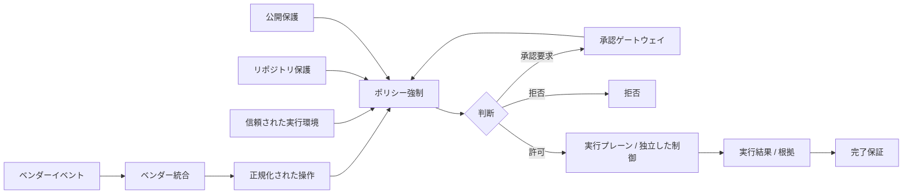
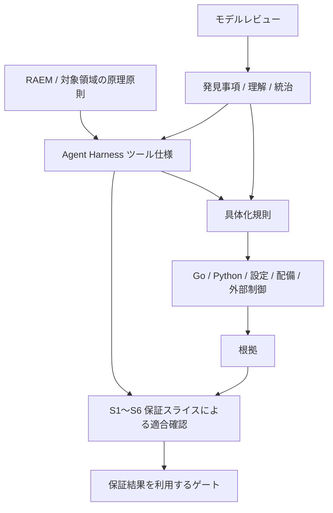

[README](../../README.ja.md) | [アーキテクチャ](../ja/01-architecture.md) | [RAEM](../../raem/refinement-assurance-and-evolution-model.ja.md)

# Agent Harness ツール仕様書

## 1. 文書の位置づけと状態

**状態: 草案 / 仕様書骨格。** Agent Harness 全体の、実装言語・ベンダーから独立した責務と振る舞いを定義する。既存文書に基づく契約の基線を示すが、CLI、スキーマ、数値制限などは未確定であり、完成済みの実装仕様や適合宣言ではない。

本文の「契約」は今後の具体化・適合確認が満たすべき要求、「詳細化項目」は実装前に仕様として決定する事項を表す。後者は第20章の未決事項に対応する。未決事項を実装の偶然の挙動で確定したことにしてはならない。部分実装は対象契約・未対応契約・成立前提を明示する。

**S1〜S6 は保証スライスであり、ツールのコンポーネント、実行フェーズ、CLI の分類ではない。Go / Python は具体実装であり、仕様そのものではない。** S1 の具体化を先行しても、全体仕様を「Go版S1ツール仕様」に限定しない。

### 既存文書との分担

| 文書 | 所有する内容 | 本仕様の役割 |
|---|---|---|
| [アーキテクチャ](../ja/01-architecture.md) | 制御プレーン / 実行プレーン、状態機械、配置の全体像 | ツールの責務と境界に接続する |
| [設計原則](../ja/02-design-principles.md) | 設計原則と理由 | 振る舞いを制約する契約として参照する |
| [セキュリティモデル](../ja/03-security-model.md) | 脅威、多層防御、外部強制境界 | ツール側の前提・失敗時動作・非保証を明示する |
| [導入ガイド](../ja/04-adoption-guide.md) | 段階導入、権限拡大の終了条件、運用 | 導入段階と仕様適合範囲を混同しない |
| [製品マッピング](../ja/05-product-mapping.md) | 製品機能への対応と参照先 | ベンダー共通契約とアダプターの責務を定義する |
| [RAEM](../../raem/refinement-assurance-and-evolution-model.ja.md) | 具体化、適合保証、モデルレビュー、進化と統治 | Agent Harness という対象の仕様へ適用する |
| 本仕様 | ツールの意味・契約・未決事項 | 具体実装と保証スライスの共通参照点になる |

既存文書の説明・製品機能表・配備手順を複製しない。要求の矛盾が見つかった場合は、実装を正として上書きせず、根拠と影響を記録して仕様と関連文書を整合させる。必要になった詳細仕様は本書からリンクし、同じ契約を複数文書で独立管理しない。

## 2. 全体像と目的

Agent Harness は、自律型ソフトウェア開発エージェントの提案する操作を、明示した権限・信頼境界・予算・完了条件の中で実行するための仕組みである。安全な通常操作を自律的に進め、境界を越える操作を拒否または適切な承認経路へ送る。名称は単一実行ファイルを意味せず、制御、実行環境、外部認可との接続を含む。

利用者・運用者はタスク、許可範囲、完了条件を定める。エージェントは調査・計画・実装・未知の問題の探索を担う。Agent Harness は決定可能な規則の評価と結果の記録を担い、OS / IAM / ソースコード管理システム等が独立した強制境界を提供する。

期待する成果は、操作判断の再現性、最小権限での自律実行、根拠に基づく完了判定、失敗から復旧・改善できる運用である。すべての要求を機械判定できるという主張ではない。

## 3. 用語と責務境界

本文で使用する用語の意味は、独立した[用語集](agent-harness-glossary.ja.md)を共通の参照先とする。製品固有の名称と同じ語がある場合も、用語集の定義を共通契約上の基準とする。

### 主体と責務境界

| 主体・概念 | 責務 | 境界 |
|---|---|---|
| エージェント / サブエージェント | 推論、操作提案、成果物作成、モデルレビュー | 自身の出力を承認・保証の最終権威にしない |
| Agent Harness の制御プレーン | ポリシー、承認、予算、タスク状態、完了状態の管理 | 正本をモデルコンテキスト外に保持する |
| 実行プレーン | 許可された操作を制限された環境で実行する | ポリシーの `allow` により能力境界を解除しない |
| 運用者 | 信頼された設定、配備、強制境界を管理する | リポジトリ管理下の指示と独立し、承認者や承認ゲートウェイの責務を暗黙に兼ねない |
| 承認者 | 自身に委譲された権限の範囲で承認を付与・拒否する | 自身の権限を越える承認を付与せず、ポリシーの `deny` を反転させない |
| 承認ゲートウェイ | 承認者を認証し、承認を操作・対象・適用範囲・有効期限へ結びつけて検証する | 承認を自ら生成せず、`deny` を反転させない |
| 外部強制機構 | サンドボックス、ワークロード分離、ネットワーク、IAM、ソースコード管理システムの強制 | フックやエージェントの協力に依存しない |
| 正規化された操作 | 操作・対象・文脈を表す共通モデル | 入力上の自己申告と検証済み事実を区別する |
| 根拠 | 判断・適合主張を支える根拠 | 出所、対象、取得時点、評価条件を持つ |

## 4. 論理アーキテクチャ

| 機能・責務 | 入力と出力の概念 | 主な接続先 |
|---|---|---|
| 信頼された実行環境 | 信頼された起動・設定を確立し、検証結果を返す | 全コンポーネント |
| ポリシー強制 | 正規化された操作と検証済み文脈から `allow` / `ask` / `deny` を返す | リポジトリ保護 / 公開保護、承認ゲートウェイ |
| リポジトリ保護 | リポジトリ識別情報とリポジトリ状態から変更権限を検証する | ポリシー強制、実行直前の検証 |
| 公開保護 | 公開対象・差分・外部権限を検証する | Git / PR、制御プレーン変更検出 |
| 完了保証 | 根拠と完了条件から判定・不足を返す | オーケストレーター、CI、モデルレビュー |
| ベンダー統合 | ベンダーイベント / 応答と共通契約を相互変換する | エージェント実行環境、ポリシー強制 |

これらは論理上の責務であり、プロセス数、パッケージ構成、言語、配置を指定しない。承認、監査、永続状態、予算は横断的な制御プレーンの責務とする。

図は論理フローであり、フックがすべての経路を捕捉できるという主張ではない。呼出し契約は第9章、捕捉できない経路の扱いは第15・16章で定める。

## 5. 原理原則

[設計原則](../ja/02-design-principles.md)を基線とし、次を契約に反映する。

- LLM、プロンプト、AGENTS.md、スキル、サブエージェントは行動制御であり、セキュリティ境界にしない。
- 意味論的ポリシーと能力制御を分離し、OS、ワークロード、ネットワーク、外部認可による多層防御を保つ。
- 最小権限と限定的な承認経路を採用し、`deny` を承認で上書きしない。
- 既知で決定的に表現可能な判断を仕組みに固定する。同じ入力・規則・評価条件には同じ判断を返す。
- 完了は根拠に基づく完了条件とし、自律ループには上限を設ける。
- エージェントが見つけた未知の問題はモデルレビューと統治を通して仕様へ反映する。エージェント自身の判断で規範や強制境界を緩めない。

## 6. 信頼モデルと信頼された実行環境

**契約 TR-01:** 信頼された実行物と設定の選択・完全性は、対象リポジトリやエージェントが変更できる入力に委ねない。現在の作業ディレクトリ、インポートパス / 実行ファイル検索パス、環境変数、シンボリックリンク、リポジトリ内設定から任意の実行物・アダプター・ポリシーへ差し替えられる構成を信頼されたものとみなさない。

信頼された設定、承認情報、永続タスク状態と、リポジトリ内容、フックの入力データ、ツール出力、モデル生成文を区別する。後者は検証対象であり、入力に「信頼済み」と書かれているだけでは信頼しない。信頼できることは、単なる絶対パスの使用や単一バイナリ化からは導けない。

**詳細化項目:** 信頼基点の選択主体、所有権・権限、配布・更新・失効、パス解決、シンボリックリンク、環境変数の許容範囲、起動時と利用時の再検証を定義する（Q-01）。信頼されたコンピューティング基盤（TCB）と配備前提は第16章を参照。

## 7. 実行モデル

[アーキテクチャの状態機械](../ja/01-architecture.md)を基線に、調査 → 計画 → 専用ワークツリーで変更 → 検証 → コミット → 公開 → CI 確認 → 完了判定を扱う。読み取り専用タスクは変更・公開を要求せず、タスクで宣言した完了条件へ進む。PR 作成はマージの認可を意味しない。

**契約 EX-01:** タスク識別情報、状態、承認、予算、判断の根拠をモデルコンテキスト外に保持する。再起動・コンテキスト圧縮・サブエージェント実行後も正本に照合し、状態や権限をモデルの記憶から再構成しない。

**契約 EX-02:** `ask` は承認待ち、`deny` は対象操作の拒否とする。失敗や予算超過を完了扱いにせず、再試行は上限内で行う。引き継ぎは信頼境界の遷移として再認可する。

**詳細化項目:** 状態遷移条件、並行操作、再開、取消、冪等性、予算計数、遮断機構を定義する（Q-06）。

## 8. ツールの振る舞い

**契約 BH-01:** 実行前に入力検証・正規化、信頼と対象の検証、適用ポリシーの評価、必要な承認の検証を行う。アダプターは判断をベンダー応答へ変換する。実行後は結果と根拠を記録し、必要な完了条件を評価する。

| 判断 | 呼出し側に要求する振る舞い |
|---|---|
| `allow` | 評価した対象・範囲内でのみ実行可能。サンドボックス / 外部認可への許可を代替しない |
| `ask` | 有効な承認が得られるまで実行しない。承認後も現在のポリシーと対象を再評価する |
| `deny` | 対象操作を実行しない。通常の承認で反転しない |

**契約 BH-02:** 判断と実行成功を区別する。`allow` の返却は実行完了の証拠ではなく、`deny` の返却だけで外部の強制が成功したともみなさない。出力不能・タイムアウト・未対応イベントの扱いは第15章に従う。

**契約 BH-03:** `allow` / `ask` / `deny` のすべての判断、承認の要求・付与・拒否・失効、実行結果、完了判定を監査記録へ残す。各記録はタスク識別情報、正規化された操作、ポリシー識別情報、判断理由、承認主体・適用範囲・有効期限、対象となる実行・根拠と相関できなければならない。秘密情報は記録せず、監査書込失敗を許可・実行成功・完了へ変換しない。

**詳細化項目:** 監査記録のスキーマ、保存先、完全性、秘匿化、保持期間、配信保証、閲覧権限、書込失敗時の停止・復旧境界を定義する（Q-09）。

## 9. コマンドラインインターフェースとプロトコル

本章は言語非依存の外部契約の定義場所である。現行 Python の起動方法や Go のパッケージ構成を標準 CLI として採用済みとはみなさない。

| 契約面 | 詳細化すべき事項 |
|---|---|
| 起動 | 実行ファイル名、引数・サブコマンド、実行モード、現在の作業ディレクトリ、環境変数、設定解決 |
| 入力 | 正規化された操作とベンダー入力データの境界、スキーマ / バージョン、必須・任意フィールド、型、未知フィールド、サイズ制限 |
| 出力 | 判断、理由、規則 / ポリシー識別情報、相関 ID、エラーの表現、スキーマ / バージョン |
| 入出力 | `stdin` / `stdout` / `stderr`、文字コード、メッセージ境界、単発・継続処理、ログとの分離 |
| 終了 | 終了コードとポリシー判断の関係、シグナル、タイムアウト、取消、出力途中の終了 |

**契約 IO-01:** 機械可読応答と診断ログを混在させない。標準入出力上の JSON を採用するモードでは `stdout` をプロトコル専用とする。成功終了コードだけを `allow` の意味にせず、応答と終了状態の対応を明示する。

**詳細化項目:** 通信スキーマ、CLI 形式、具体的な終了コード、正常・異常例、互換性規則を確定する（Q-02）。本章のフィールド名は概念であり、確定した通信スキーマではない。

## 10. ポリシー

**契約 PO-01:** `deny` は競合する `ask` / `allow` より優先する。`ask` は外部承認を必要とする判断、`allow` は制約下の実行許可である。分類不能な操作や必須の信頼検証失敗を暗黙の `allow` にしない。

**契約 PO-02:** 評価結果を再現するため、ポリシー識別情報 / バージョン、正規化入力、参照した外部状態と評価条件を根拠に結びつける。「同じコマンド文字列」だけを同一入力とみなさない。

**詳細化項目:** ポリシースキーマ、規則の評価順序と競合時の理由選択、`ask` と `allow` の優先関係、既定判断、照合方法 / 正規表現の意味、未知フィールド、スキーマ検証、更新と承認の失効を定義する（Q-03）。欠落・読取不能・不正なポリシーは第15章に従い、リポジトリ内の代替ポリシーへ暗黙に切り替えない。

## 11. リポジトリ保護

**契約 RE-01:** リポジトリ識別情報、ワークツリー / ブランチ、リモート、リポジトリ状態と操作権限を検証する。入力データや現在の作業ディレクトリの自己申告だけで変更権限を与えない。

**契約 RE-02:** 通常の変更はタスク専用ワークツリー / 機能ブランチで行い、制御用チェックアウトと保護ブランチ / 既定ブランチの直接変更を通常の自律経路に含めない。コミット / push 前に対象を再検証する。

**詳細化項目:** リポジトリ識別情報の正本、リポジトリ状態の取得元・鮮度、ワークツリーとブランチの対応、シンボリックリンクや別リモート、検証と実行の間の状態変化（TOCTOU）を扱う（Q-04）。外部のソースコード管理システムによる保護をローカル判定だけで保証したことにしない。

## 12. 公開保護

**契約 PU-01:** Git push と PR 作成は、検証済みのリポジトリ / ブランチ / コミットと認可範囲に結びつける。マージ、タグ / リリース、本番環境への公開は通常の機能ブランチ公開と区別し、明示した認可経路を必要とする。

**契約 PU-02:** CI ワークフロー、ポリシー、フック、権限・配備設定などの制御プレーン変更を識別し、通常のアプリケーション変更と同じ根拠だけで公開を許可しない。検査対象をワークツリーだけに限定せず、実際に公開する差分・コミットと結びつける。

**詳細化項目:** 制御プレーン分類と管理主体、push の参照仕様 / 宛先、PR の変更元 / 変更先、差分の確定方法、認可・根拠の有効範囲を定義する（Q-05）。ソースコード管理システムのサーバー側認可を最終権威とし、ローカル許可による迂回を認めない。

## 13. 完了保証

**契約 CO-01:** 完了条件はタスクに対して明示し、テスト、Git / PR / CI 状態などの根拠で決定的に評価する。モデルの完了宣言や自己評価を合格の根拠にしない。必要な根拠が欠ける・古い・対象が異なる場合は完了としない。

**契約 CO-02:** 判定結果を利用する完了ゲートと、主張・根拠・推論による適合保証を区別する。エージェントの完了レビューループは不足の修正や未知の問題の発見を担い、決定的な判定を上書きしない。再試行とレビューには予算・停止条件を設ける。

**詳細化項目:** 完了条件の宣言者、結果状態と不足理由、根拠の出所・鮮度・コミットとの結びつき、保存期間、予算枯渇時の処理を定義する（Q-06、Q-07）。具体的なチェック一覧の例は[アーキテクチャ](../ja/01-architecture.md)を参照する。

## 14. ベンダー統合

**契約 VE-01:** ベンダーイベントを正規化された操作へ、共通判断をベンダー応答へ変換する。ポリシーエンジンに製品固有のスキーマや偶然の終了コードを埋め込まない。アダプターの選択も信頼された設定の境界に含める。

**契約 VE-02:** アダプターごとに対象製品・バージョン、対応イベント、承認方法、タイムアウト / 異常終了 / 不正な出力の実動作、捕捉できない操作経路を明示する。共通契約を実現できない機能をサポート済みと表示しない。未対応を `allow` へ読み替えない。

**詳細化項目:** 対応能力の宣言、バージョン対応表、変換不能時の応答と配備の可否、アダプター適合テストデータを定義する（Q-08）。具体的な製品情報は[製品マッピング](../ja/05-product-mapping.md)と各製品の公式文書・検証結果で管理する。本仕様は各製品の現時点の機能を新たに保証しない。

## 15. 失敗時の意味論

**契約 FA-01:** セキュリティ上重要な検証が成立しない場合、Agent Harness は許可・完了を返さない。拒否を表現できない通信 / 実行環境の失敗は、失敗として伝播させる。呼出し元がそれを無視して継続する場合はフェイルオープンとして記録し、その経路の重要な不変条件をフックだけに依存させない。

| 条件 | 意味上の結果・復旧境界 |
|---|---|
| 不正な入力、必須フィールド欠落、型不正 | 処理失敗。許可を返さず入力を修正する |
| ポリシー欠落・不正・読取不能 | 処理失敗。運用者が信頼されたポリシーを復旧する |
| 実行物・設定の信頼境界違反 | 拒否または起動失敗。リポジトリ側の代替物で継続しない |
| リポジトリ / 公開の検証不能、対象変化 | 許可を返さず、正本から再取得・再評価する |
| 承認未取得・失効・適用範囲の不一致 | 実行しない。必要な承認を取得して再評価する |
| 外部 API / ソースコード管理システム / ネットワークエラー | 成功と断定しない。外部状態を照合してから再試行する |
| タイムアウト、シグナル、異常終了 / パニック、予期しない内部例外、入出力エラー | 許可や成功へ変換しない。呼出し元の停止挙動を別途検証する |
| 根拠不足、必須 CI の失敗・保留 | 完了不成立。不足・失敗を報告する |
| 再試行 / 時間 / ツール / コストの予算超過 | 自律ループを停止し、状態と理由を保持する |

エラーを受け取っても、すでに生じた副作用が取り消されたとはみなさない。特に公開後に応答を失った場合は、外部状態が不明なまま同じ操作を反復しない。

**詳細化項目:** エラー分類、再試行可否、待機間隔、部分成功、監査書込失敗時の扱い、終了状態 / 通信上の表現を定義する（Q-02、Q-06、Q-09）。

## 16. セキュリティ上の前提と配備前提

[セキュリティモデル](../ja/03-security-model.md)の脅威・信頼されたコンピューティング基盤（TCB）・多層防御を適用する。具体実装の適合性はコードだけではなく、設定・配置・外部保護・実行時状態・運用前提を含めて評価する。

| 前提 | 確立・検証する主体 | 前提が欠ける場合の限界 |
|---|---|---|
| 実行物・ポリシー・アダプターの完全性と更新権限 | 配布・運用管理者 | 信頼された判断主体を主張できない |
| OS / ファイルシステム / プロセス境界、エージェントからの設定保護 | 実行環境管理者 | ローカルポリシーの改変・迂回を封じ込められない |
| サンドボックスとワークロード分離 | 実行環境管理者 | ホスト / 他ワークロードの保護を主張できない |
| ネットワーク制御、認証情報の適用範囲 / 有効期限 | ネットワーク / IAM 管理者 | 到達可能先・外部権限を限定できない |
| ソースコード管理システムの規則 / ブランチ保護と迂回不能な認証情報 | ソースコード管理システムの管理者 | 保護ブランチの最終防御を主張できない |
| 実際のフック失敗時動作と経路の網羅性 | アダプター / 配備管理者 | フックによるフェイルクローズな強制を主張できない |

エージェントのリポジトリ書込権限に、信頼されたポリシーの更新権限を含めない。MCP / 外部ツールも独立した認証・認可を必要とする。前提が成立しない配備で、成立時と同じ保証を表示しない。段階導入は[導入ガイド](../ja/04-adoption-guide.md)の終了条件に従う。

## 17. 非目標と非保証範囲

- LLM の完全な正しさ、プロンプトインジェクションの完全排除、フック単独による全操作の封じ込め。
- サンドボックス、コンテナ、IAM、ソースコード管理システムのサーバー側ポリシーの置換。
- Go / Python 固有の内部構造、全ベンダー機能の統一、単一実行ファイルへの強制。
- すべての実装言語・配備環境での同一保証や、未検証のアダプターの動作保証。
- 汎用的な本番管理権限、自動マージの暗黙認可、無制限の修復ループ。
- テスト合格による未知の欠陥の不存在証明、RAEM 自体の再定義。

## 18. 互換性と仕様の進化

**契約 CP-01:** 互換性を、意味・保証契約、CLI / 通信スキーマ、ポリシースキーマ、アダプター / 配備の各軸で記録する。Go / Python の比較では対応する契約とテストデータを明示し、片方の出力との一致だけを仕様適合としない。

現行実装の挙動は具体化・評価の資料である。仕様との差異は、仕様側の未決、実装側の不適合、意図的な互換性変更を区別する。言語固有のインポートパス、例外、正規表現、直列化等を無条件に共通契約へ引き継がない。

**詳細化項目:** バージョン管理、互換範囲、移行期間、廃止、バージョン不一致時の扱い、比較表の保管場所を定義する（Q-10）。骨格段階の本書から、既存 CLI との互換性を宣言しない。

## 19. テスト契約と保証との関係

RAEM では具体化と適合保証を分離する。本仕様は Agent Harness に必要な契約をまとめ、具体化規則が Go / Python・設定・配備・外部制御へ接続する。S1〜S6 はその具体化が何を保証するかを、主張・根拠・推論で横断的に確認する別軸である。

### 保証スライスとの参照対応

以下はレビュー観点の索引であり、スライスの保証契約そのものや適合済みの宣言ではない。1 機能と 1 スライスの一対一対応を強制しない。

| 保証スライス | 主に参照するツール契約 |
|---|---|
| S1 信頼された実行 / ポリシー | TR-01、PO-01/02、IO-01、FA-01、配備前提 |
| S2 リポジトリ権限 | RE-01/02、EX-01、TR-01 |
| S3 ソースコード管理システムへの公開 | PU-01、RE-01/02、PO-01/02 |
| S4 制御プレーン公開 | PU-02、TR-01、PO-01 |
| S5 完了保証 | CO-01/02、EX-01/02、FA-01 |
| S6 ベンダー / 配備 | VE-01/02、FA-01、配備前提、CP-01 |

BH-03 の監査契約は全スライスを横断する。各スライスは、その保証対象で発生する判断、承認、実行、完了の監査記録と相関を確認する。

S1〜S6 の保証契約、根拠、評価結果、作業状態は各保証スライスの管理文書で保持する。本書は個別スライスの採用・実装・作業状態を前提としない。

### 適合確認で用意するもの

- 契約 ID → 具体化規則 → 実装・設定 → 根拠 → 保証規則 → 結果の対応表。
- ポリシー / 正規化 / スキーマの単体テストと、言語間で共有または対応する正常・異常テストデータ。
- 信頼された起動、現在の作業ディレクトリ / 環境 / パスの差し替え、リポジトリ誤認、公開対象変化、承認不一致の否定 / 統合テスト。
- タイムアウト / 異常終了 / 不正な応答、未対応バージョン、迂回経路に対するアダプター / 配備テスト。
- 根拠の欠落・古さ・対象違い、CI 保留、予算枯渇、再開を含む完了テスト。
- 判断、承認、実行、完了の監査記録と相関、秘匿化、書込失敗を含む監査テスト。
- 外部 IAM / ソースコード管理システム / サンドボックスの根拠。単体テストで外部保護の成立を代用しない。

**詳細化項目:** テストデータの形式・配置、CI 必須条件、部分適合の表示、保証規則のバージョンを定義する（Q-11）。全テスト合格とモデルの十分性は別であり、モデルレビューを継続する。

## 20. 未決事項

骨格作成で CLI や配備方式を先取りしない。各問いは担当する契約と解決条件を持ち、関連部分の実装着手前に解決するか、実験としての仮定・非適合範囲を明記する。全機能の詳細確定まで部分的な具体化を止める必要はない。

| ID | 未決事項 | 解決に必要な成果物・判断時点 |
|---|---|---|
| Q-01 | 信頼基点 / バイナリ / ポリシー / アダプターの所有・解決・更新・失効、パス / シンボリックリンク / 環境変数 | 信頼解決契約と攻撃ケース。信頼された実行環境の具体化前 |
| Q-02 | CLI、通信スキーマ、未知フィールド、サイズ、入出力、終了コード / シグナル / タイムアウト | 入出力契約と正常・異常例。CLI / アダプターの具体化前 |
| Q-03 | ポリシースキーマ、競合と順序、既定判断、照合方法、承認の適用範囲 / 有効期限 | ポリシーと承認の評価規則・テストデータ。ポリシーの具体化前 |
| Q-04 | リポジトリ識別情報 / リポジトリ状態の正本・鮮度、TOCTOU | 取得・再検証契約と誤認ケース。リポジトリ保護の具体化前 |
| Q-05 | 公開差分・参照の確定、制御プレーン分類、認可範囲 | 公開契約と対象変更ケース。公開保護の具体化前 |
| Q-06 | 永続状態、並行性、再開・取消・冪等性、予算と再試行 | 状態遷移・復旧契約。オーケストレーター / 完了ループの具体化前 |
| Q-07 | 完了条件の宣言、根拠の信頼・鮮度・対象・保持 | 完了 / 根拠の契約。完了保証の具体化前 |
| Q-08 | アダプターの対応能力 / バージョンとフェイルオープンの補完 | 実動作の適合表と配備条件。各アダプターのサポート宣言前 |
| Q-09 | エラー分類、部分成功、監査スキーマ・完全性・秘匿化・保持・配信保証・閲覧権限・書込失敗 | 失敗 / 監査契約とテストデータ。関連する外部操作・記録の具体化前 |
| Q-10 | 仕様・スキーマのバージョン、互換性と移行 | 互換性方針と実装差分表。安定版契約の公開前 |
| Q-11 | テストデータ、追跡可能性、必須 CI、部分適合表示 | テスト / 保証契約。各範囲の適合宣言前 |

[Issue #14](https://github.com/tomo-chan/agent-harness/issues/14) の Go による試作は、全体仕様の信頼された実行環境 / ポリシー強制を Go で具体化し、S1 保証スライスで評価する作業として位置づける。Go の配布・内部構造・Python との差分と、本仕様で未決の契約に対する実験上の仮定は [Go 実装ノート](../implementation/go/implementation-notes.ja.md)で扱い、本仕様の名前や章立てを Go / S1 専用へ戻さない。
